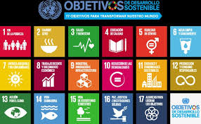

# **1.2.2. Objetivos y metas específicas de los ODS aplicables a Nuestro Sector Productivo**  

En la siguiente tabla se presentan algunos de los **objetivos y metas** de los ODS aplicados al sector de Informática y Comunicaciones:

| **ODS** | **Meta** | **Aplicación en Informática y Comunicaciones** |
|---------|---------|-----------------------------------------------|
| **ODS 9** | 9.4: Modernizar la infraestructura y hacerla sostenible. | Desarrollo de software de bajo consumo y centros de datos verdes. |
| **ODS 12** | 12.5: Reducir la generación de desechos electrónicos. | Promoción del reciclaje de dispositivos electrónicos. |
| **ODS 13** | 13.3: Educación y concienciación sobre cambio climático. | Implementación de tecnología para mejorar la eficiencia energética. |
| **ODS 4** | 4.3: Acceso equitativo a educación superior. | Desarrollo de cursos online gratuitos y de calidad. |

📌 Regresa a [1.2.1. Selección de los ODS más relevantes](1.2.1_SeleccionODS_Camacho.md).  
📌 Regresa a [1.2. ODS más relevantes](1.2_ODS_Camacho.md).  
📌 Para volver al inicio, accede a [Identificación de los aspectos de sostenibilidad y ODS](1_Identificacion_Camacho.md).
