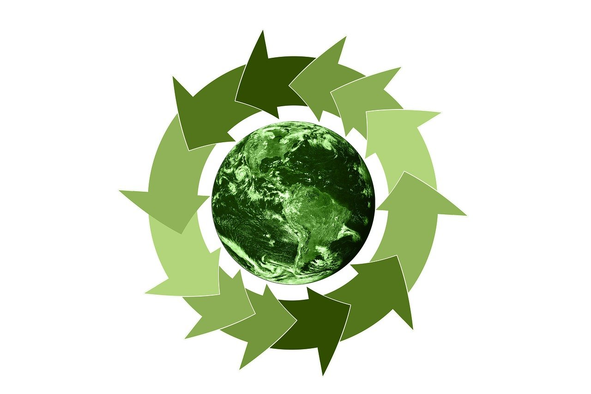

## 2. Riesgos y Oportunidades en los ODS del Sector  

>🌍 La **sostenibilidad** es un factor clave en el desarrollo de cualquier sector productivo. En este capítulo, exploraremos los principales ⚠️ **riesgos** y 💡 **oportunidades** que surgen al alinear nuestra actividad con los **Objetivos de Desarrollo Sostenible** (ODS). 
>🔍 Identificar estos aspectos nos permite anticipar desafíos, minimizar impactos negativos y aprovechar nuevas posibilidades de crecimiento responsable. 

