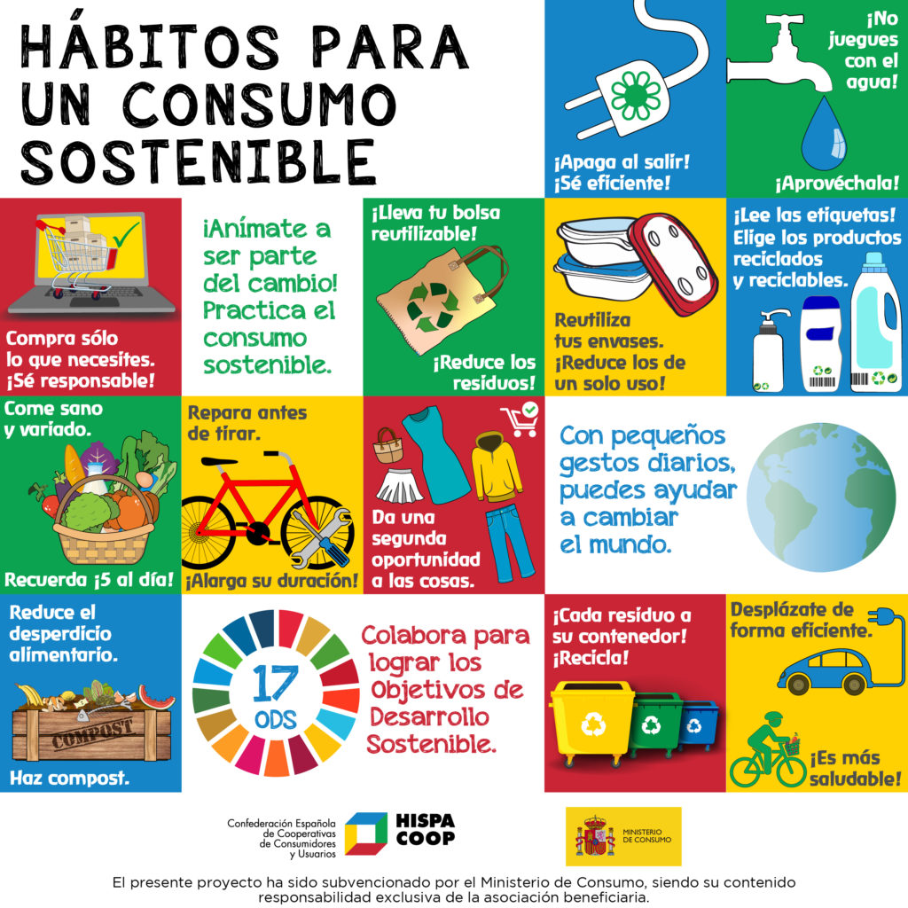

# **3.1. Estrategias personales para la sostenibilidad**  
## **Transformación de hábitos individuales para contribuir al logro de los ODS**  

Cada persona puede **contribuir a la sostenibilidad** a través de pequeños cambios en su día a día. En el sector de **Informática y Comunicaciones**, estas son algunas estrategias clave:

### 🌱 **Hábitos sostenibles en el consumo de tecnología**
- **Reducir** la compra innecesaria de dispositivos electrónicos.
- **Reutilizar** equipos en lugar de reemplazarlos constantemente.
- **Reciclar** adecuadamente teléfonos, ordenadores y accesorios electrónicos.

### ⚡ **Eficiencia energética en el uso de dispositivos**
- Configurar **modos de ahorro de energía** en ordenadores y móviles.
- Apagar dispositivos cuando no se usen.
- Utilizar **software optimizado** para reducir el consumo de energía.

### 📡 **Fomento del teletrabajo y la digitalización**
- Reducir desplazamientos innecesarios con herramientas digitales.
- Priorizar reuniones virtuales en lugar de viajes de negocio.
- Evitar el uso excesivo de servidores físicos mediante almacenamiento en la nube.

> "La sostenibilidad comienza con cambios individuales que, a gran escala, generan un impacto positivo."

📌 Para conocer buenas prácticas en el ámbito profesional, accede a [3.2. Adopción de prácticas sostenibles en el ámbito profesional](3.2_PracticasProfesionales_Camacho.md).  
📌 Regresa a [Retos ambientales y sociales](3_RetosSostenibilidad_Camacho.md).
