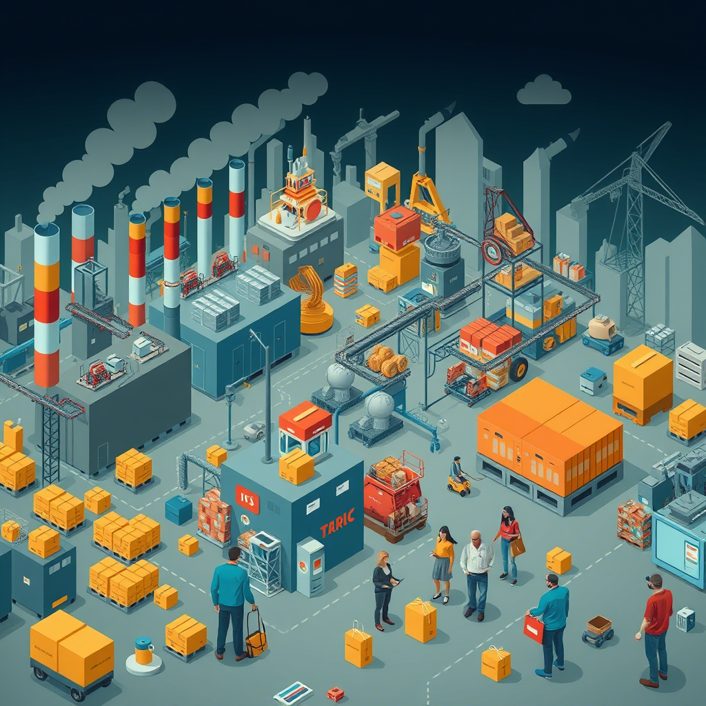
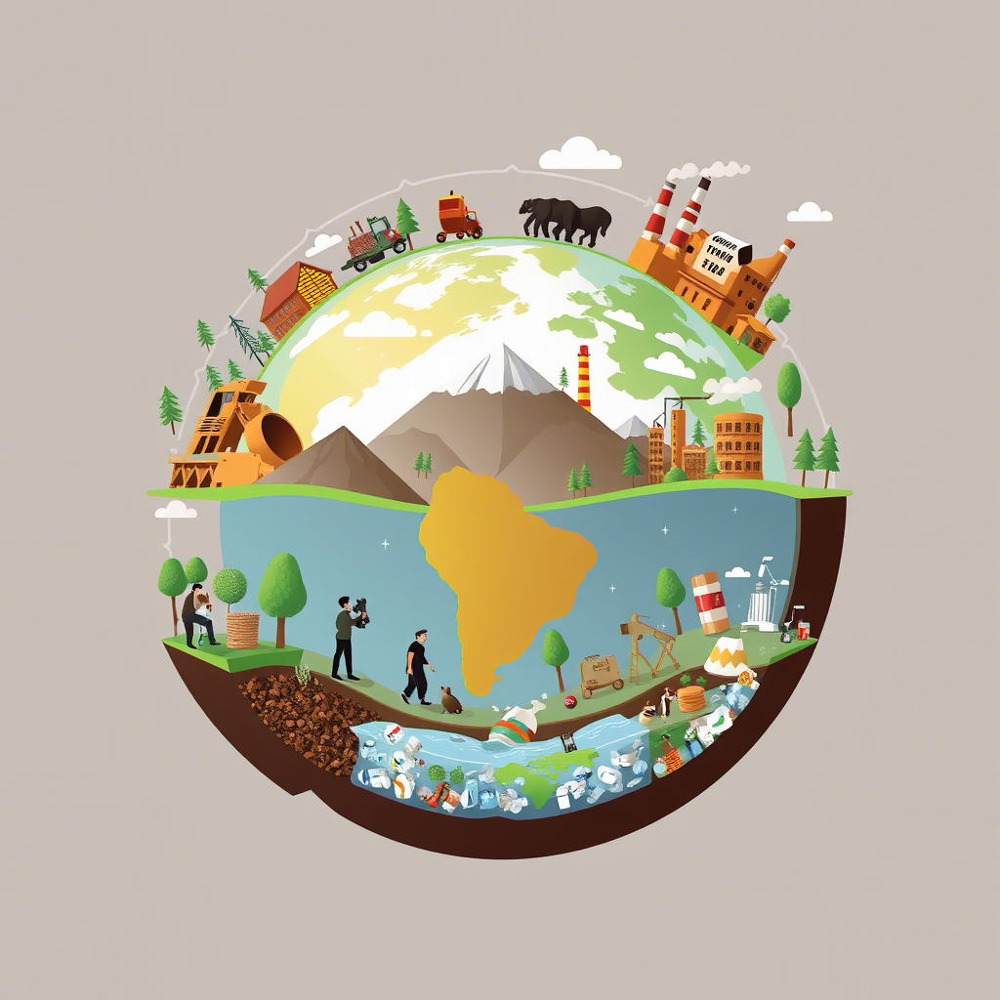
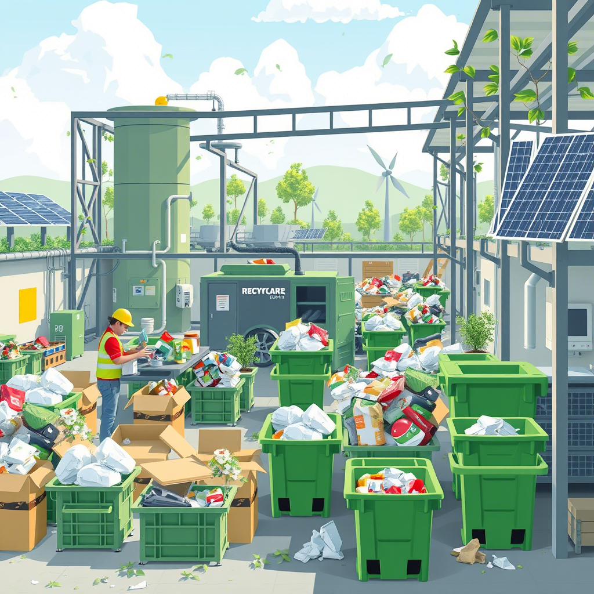

[Índice](Indice_pisa3_F_García_Navarro)📖
[Avanzar capitulo 4.1](4.1.Caracterización_del_modelo_lineal_extraer,producir,_usar_y_tirar_García_Navarro)➡️
El modelo lineal de **producción** y **consumo**, caracterizado por las fases de **extraer** ⛏️, **producir** 🏭, **usar** 🛒 y **tirar** 🚮, ha sido dominante desde la Revolución Industrial. Aunque inicialmente este modelo permitió un desarrollo económico rápido 💰, ha generado serios problemas medioambientales 🌱 debido a su falta de consideración por la sostenibilidad 🌍 a largo plazo.

---

---
## **1. Extraer: La base del modelo lineal** ⛏️🌳

El primer paso en el modelo lineal es la **extracción de recursos naturales** de la Tierra 🌍. Esto incluye una variedad de actividades como la minería 🏞️, la agricultura intensiva 🌾 y la tala de bosques 🌲. Los recursos extraídos son transformados en productos y bienes que serán consumidos. Sin embargo, la extracción de estos recursos tiene impactos negativos graves en el medio ambiente 🌱.

> _"La sobreexplotación de recursos no renovables está llevando a una pérdida irreversible de biodiversidad 🦋 y alterando los ecosistemas en todo el planeta."_

#### **Impactos de la extracción de recursos:** 🌱

- **Destrucción de ecosistemas** 🌳: La tala masiva de bosques, la minería y la expansión agrícola son responsables de la destrucción de hábitats naturales 🏞️.
- **Contaminación del suelo y agua** 💧: La extracción de minerales y petróleo a menudo provoca la contaminación de fuentes de agua cercanas 🌊, afectando la biodiversidad 🦠.
- **Agotamiento de recursos naturales** ⛏️: El uso continuo de recursos no renovables está llevando a la disminución de las reservas disponibles de metales, petróleo y otros materiales esenciales ⛏️.

#### **Ejemplos de recursos extraídos:** ⛰️⛏️

- **Minerales** ⚒️: cobre, oro, litio, que se usan en dispositivos electrónicos 📱 y baterías 🔋.
- **Energía** ⚡: petróleo, gas natural y carbón ⛽, esenciales para la producción de electricidad 💡 y transporte 🚗.
- **Agricultura** 🌾: tierra, agua 💧 y productos agrícolas 🍅, que son utilizados para alimentar a la población mundial 🌍.

---

### **2. Producir: Transformación de los recursos en bienes** 🏭🚧

Una vez que los recursos son extraídos, el siguiente paso es la **producción**. Los materiales se transforman en productos manufacturados que se venden en el mercado 🛒. La **producción masiva** 📦 es uno de los sellos distintivos del modelo lineal, impulsada por la eficiencia 🧠 y la economía de escala 📈.

#### **Impactos de la producción masiva:** 📦⚙️🪴

- **Uso intensivo de energía** ⚡: La producción de bienes implica el uso de grandes cantidades de energía ⚡, generalmente proveniente de fuentes no renovables ⛽.
- **Emisión de gases contaminantes** 💨: Las fábricas 🏭 emiten grandes cantidades de gases de efecto invernadero, como el dióxido de carbono (CO2) 🌍, que contribuyen al calentamiento global 🌡️.
- **Generación de residuos** 🗑️: Durante la producción, se generan subproductos y residuos industriales que, en muchos casos, no son reciclados ♻️ y terminan en vertederos 🚮.

#### **Ejemplos de producción masiva:** 📦⚙️

- **Electrónica** 📱: teléfonos móviles, computadoras 💻, que requieren metales raros ⚒️ y energía ⚡ para su fabricación.
- **Textiles** 👗👚: ropa producida a gran escala, especialmente en la industria **fast fashion** 🏃‍♂️💨, que utiliza productos químicos 🧪 y materiales sintéticos.

---

### **3. Usar: El consumo de bienes por parte de los consumidores** 🛒

En esta fase, los bienes producidos se distribuyen y llegan a los consumidores 🛍️. La **sociedad de consumo** moderna promueve la compra y el uso de productos sin considerar la durabilidad ni la reutilización de los mismos ♻️. Los consumidores utilizan estos productos por un corto período ⏳ antes de que estos se conviertan en desechos 🗑️.

> _"El consumismo impulsado por la publicidad 📢 y el marketing 📣 nos ha llevado a adquirir productos que muchas veces no necesitamos 🤔, generando más residuos."_

#### **Impactos del consumo:** 🛍️

- **Sobreexplotación de recursos** 🌿: El consumo desmedido de bienes aumenta la demanda de recursos naturales 🌍, contribuyendo a su agotamiento.
- **Residuos de productos de corta duración** ⏳: Los productos diseñados para una vida útil limitada contribuyen a la acumulación de desechos 🗑️.
- **Obsolescencia programada** 🖥️: Muchos productos, como dispositivos electrónicos 📱 y electrodomésticos 🧺, son diseñados para volverse obsoletos rápidamente, forzando al consumidor a adquirir nuevos productos con mayor frecuencia 🔄.

#### **Ejemplos de consumo:** 🛒

- **Electrodomésticos** 🖥️: televisores 📺, teléfonos móviles 📱, computadoras 💻.
- **Ropa** 👗👚: la industria de la moda rápida (fast fashion) 🏃‍♀️💨 fomenta el consumo masivo de ropa barata y de corta duración.

---

### **4. Tirar: El problema de los residuos** 🚮

Finalmente, el modelo lineal culmina en la fase de **desecho** 🗑️. Los productos que ya no se utilizan son descartados 🚮, y la mayoría termina en vertederos o incineradoras 🔥. Este **desecho masivo** genera enormes cantidades de residuos que no son fácilmente reciclables ♻️ y contaminan el medio ambiente 🌎.

> _"El modelo lineal genera un ciclo de residuos donde los productos, tras su uso, se convierten en basura sin posibilidad de reutilización efectiva."_

#### **Impactos de los desechos:** 💥

- **Contaminación ambiental** 🌍: El desecho de productos no reciclables ♻️, como plásticos 🛍️ y metales ⚙️, genera contaminación en el aire 🌬️, el suelo 🌍 y los océanos 🌊.
- **Emisiones de gases de efecto invernadero** 🌡️: Los vertederos emiten metano 💨, un gas de efecto invernadero mucho más potente que el CO2 🌍.
- **Baja tasa de reciclaje** ♻️: A pesar de los esfuerzos por reciclar ♻️, solo una pequeña fracción de los productos desechados se recupera para su reutilización 🔄.

#### **Ejemplos de residuos:** 🗑️

- **Plásticos** 🛍️: bolsas, botellas 🍼 y empaques 📦 que no se descomponen fácilmente en el medio ambiente 🌍.
- **Electrónica** 📱: dispositivos electrónicos obsoletos 💻, que contienen materiales peligrosos como mercurio 💀 y cadmio ☠️.

---

## Recursos adicionales:🌱💚

- [Economía Circular: Un enfoque hacia la sostenibilidad](https://www.economia-circular.com) 🌍
- [Impactos del Modelo Lineal en el Medio Ambiente](https://www.impactoslineales.org) 📊

___