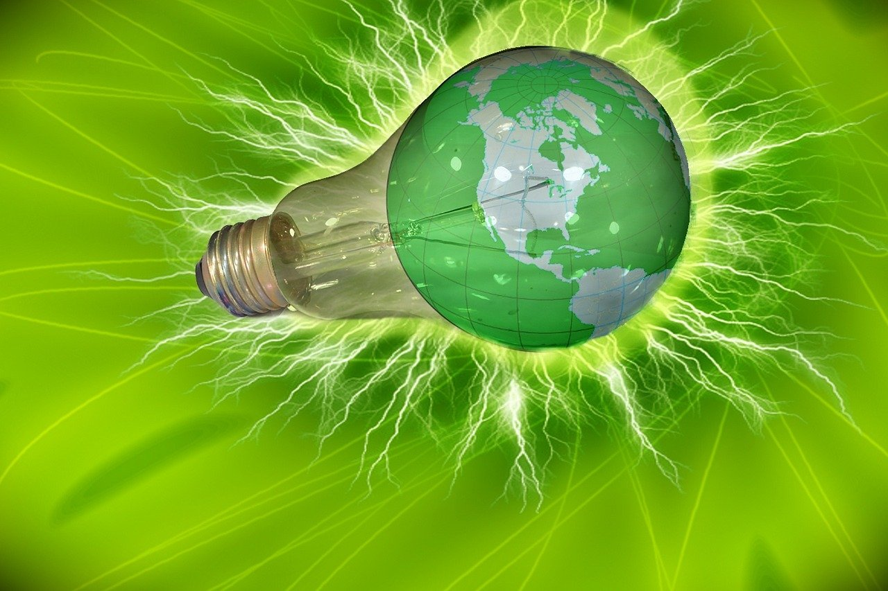

## 7. Ecodiseño: Principios y Aplicación  

>♻️ El **ecodiseño** es un enfoque fundamental para **reducir el impacto ambiental** de los productos a lo largo de su **ciclo de vida**. 🌍  
>  
>Este capítulo explora los **principios del ecodiseño**, que incluyen:  
>	✔️ **Eficiencia en el uso de materiales** 📉  
>	✔️ **Reducción de residuos** 🚮  
>	✔️ **Facilidad de reciclaje** 🔄  
>	✔️ **Optimización de la energía en los procesos de producción** ⚡  
>  
>💡 Además, se abordan **ejemplos prácticos** de cómo aplicar estas estrategias en diferentes sectores, promoviendo la creación de **productos más sostenibles** sin comprometer la **calidad ni la funcionalidad**.  
>  
>🌟 El **ecodiseño** no solo contribuye a la **protección del medioambiente**, sino que también ofrece **oportunidades de innovación y competitividad** en el mercado. 

